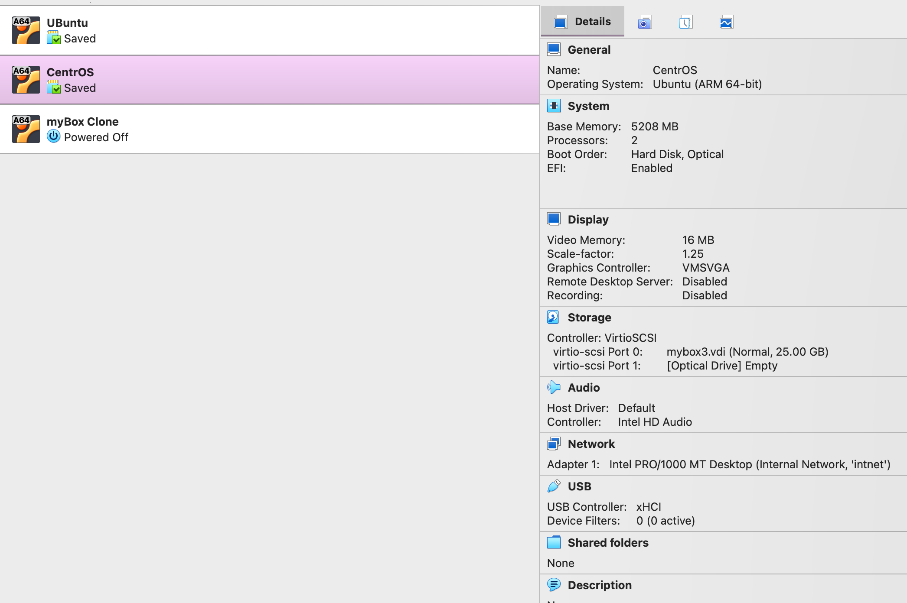
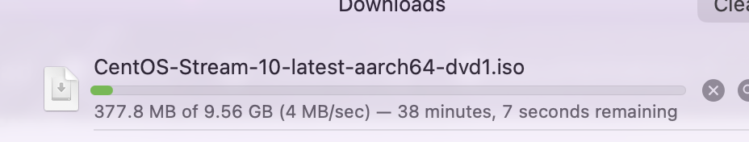
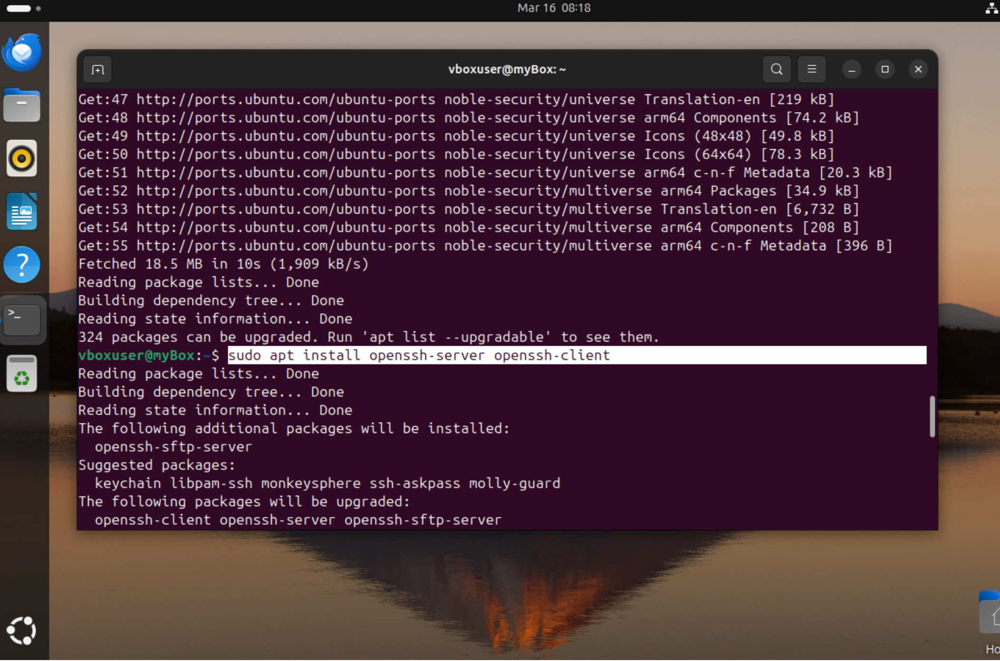
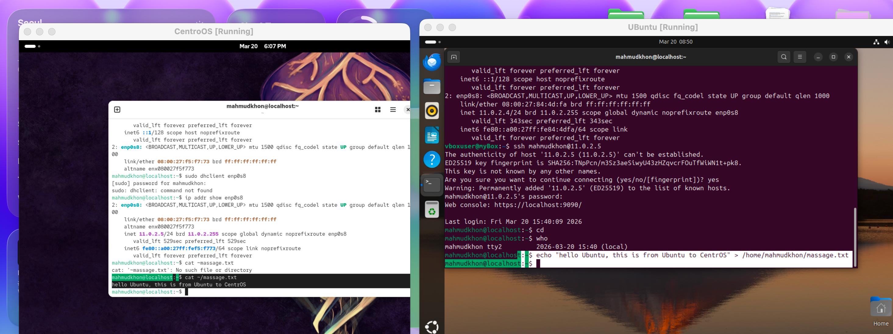
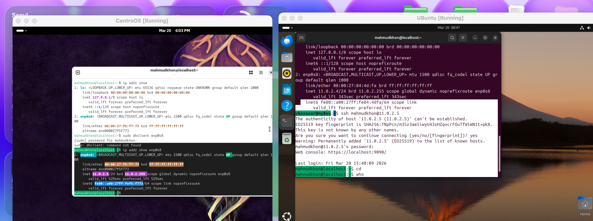

# Operating Systems: Assignment 1 - Setting Up VMs and SSH Networking

## Introduction
This guide provides step-by-step instructions for students to create two virtual machines (Ubuntu and CentOS) in a hypervisor (like Oracle VirtualBox), configure their networking, and establish secure SSH communication between the host machine and the VMs, as well as between the VMs themselves.

> [!WARNING]
> **Important Note for macOS Users:** If you are using a Mac (especially with an M1/M2/M3 chip), you may encounter specific compatibility and permission issues with VirtualBox. Please thoroughly read the **"Troubleshooting for macOS Users"** section at the bottom of this document before beginning.

## Prerequisites
- **Oracle VirtualBox** installed on your host OS.
- **Ubuntu OS ISO file** downloaded.
- **CentOS OS ISO file** (or equivalent Red Hat-based Linux distribution) downloaded.

---

## Part 1: Setting up the Virtual Machines

*Below is an overview of the assigned resources for both the Ubuntu and CentOS Virtual Machines once configuration is complete:*


### Step 1: Prepare Your Environment
Ensure you have downloaded the necessary ISO disk images for the operating systems. Launch VirtualBox to begin creating the virtual machines.

### Step 2: Create the Ubuntu VM
1. Open VirtualBox and click the **"New"** button.
2. Provide a name for the VM.
3. Select the Ubuntu ISO file you downloaded to start the automated installation process.

### Step 3: Allocate Resources for Ubuntu
To prevent system lag, allocate appropriate resources:
- Assign adequate base memory (RAM).
- Assign processor cores according to your host machine's physical hardware limits.

### Step 4: Boot and Install Ubuntu
Start the Ubuntu virtual machine. The system will load the Ubuntu kernel and display the initial boot screen. Follow the on-screen prompts to complete the formal OS installation.

### Step 5: Access the Command Line in Ubuntu
Once Ubuntu is fully installed and booted, launch the **Terminal**. This terminal will be used throughout the assignment to run commands, check configurations, and initiate SSH sessions.

---

### Step 6: Create the CentOS VM
1. In VirtualBox, click **"New"** again to start the creation process for the second virtual machine.
2. Provide a suitable VM name, select the appropriate Red Hat-based Linux version, and target the downloaded CentOS ISO file.

### Step 7: Configure the CentOS VM
Configure the initial settings:
- Customize the storage sizing.
- Set up user credentials (username and password). 
*Note: Setting these correctly is critical for logging in and administering the CentOS server later.*



---

## Part 2: Configuring the Network

### Step 8: Configure the NAT Network in VirtualBox
To allow both VMs to communicate with each other on the same secure subnet:
1. Open the **VirtualBox Preferences**.
2. Navigate to Network and create a new **NAT Network**. This acts like a virtual router bridging the VMs together.
3. In both the Ubuntu and CentOS VM settings, navigate to "Network" and ensure they are attached to this new NAT Network.

### Step 9 & 10: Verify Host Networking
1. Open up your host operating system's terminal (e.g., macOS Terminal or Windows Command Prompt/PowerShell).
2. Check your local IP address configuration (using `ifconfig` on macOS/Linux or `ipconfig` on Windows).
Verify these details to ensure there are no conflicting IP addresses that might interfere with VirtualBox's NAT Network routing.

### Step 11: Check the Ubuntu VM IP Address
Inside your Ubuntu VM terminal, identify its IP address by executing:
```bash
ip a
```
The output will show that the NAT Network successfully assigned an IP address. Note down this IP address.

---

## Part 3: Establishing SSH Connections

### Step 12: Install OpenSSH on Ubuntu
To allow Ubuntu to accept and initiate encrypted remote connections, use the `apt` package manager. Run the following command in the Ubuntu terminal:
```bash
sudo apt update
sudo apt install openssh-server openssh-client
```



### Step 13: Connect from Host PC to Ubuntu VM
Test your setup by connecting to the Ubuntu VM from the host PC over SSH:
1. Open your host PC's terminal.
2. Securely connect using the Ubuntu VM's IP address:
```bash
ssh username@<ubuntu-ip-address>
```
*(Replace `username` with your Ubuntu user name, and `<ubuntu-ip-address>` with the IP found in Step 11).*

### Step 14: Check Ubuntu SSH Status
To double-check the server's health on Ubuntu, run:
```bash
sudo systemctl status ssh
```
An `active (running)` status in green confirms that the OpenSSH background service is operating securely without crashes.

---

### Step 15: Install OpenSSH on CentOS
Switch over to your CentOS VM terminal. Because CentOS relies on the `yum` package manager, you will install OpenSSH utilities differently:
```bash
sudo yum -y install openssh-server openssh-clients
```

### Step 16: Start the SSH Service on CentOS
After installation, you must explicitly enable and start the service so CentOS will listen for incoming SSH connections:
```bash
sudo systemctl enable sshd
sudo systemctl start sshd
```

### Step 17: Get the CentOS IP Address
Find out exactly where CentOS is on the network:
```bash
ip a
```
Write down the provided IPv4 address. It will confirm that CentOS is part of the same VirtualBox NAT network as your Ubuntu machine.

---

## Part 4: Testing VM-to-VM Communication

### Step 18: Connect from Ubuntu to CentOS
Now fulfill the final "Between VMs" assignment requirement:
1. Return to the Ubuntu terminal. 
2. Direct an SSH command toward the CentOS machine:
```bash
ssh username@<centos-ip-address>
```
*(Replace `username` with your CentOS user, and `<centos-ip-address>` with the IP noted in Step 17).*
Enter the correct CentOS password when prompted to log in remotely.



### Step 19: Verify Communication Between VMs
With the connection established, provide definitive proof of administrative access. Run basic Linux file manipulation commands remotely over the connection to alter the CentOS filesystem, such as:
```bash
touch hello_from_ubuntu.txt
ls -l
```
This final action demonstrates full control over the network link and completes the practical setup.



---

## Comprehensive Troubleshooting Guide for macOS Users

If you are a student utilizing a Mac computer (whether an Intel or Apple Silicon model), there are some notoriously common pitfalls associated with macOS virtualization, system permissions, and network bridging. Please carefully review the categories below to solve 100% of the standard connection, input, output, and installation problems.

### Phase 1: Installation & Architecture Problems

**Problem A: Apple Silicon (M1/M2/M3 chips) "Architecture Mismatch" Error**
- **Symptom:** Your VM fails to boot, crashes instantly, or VirtualBox fails to install.
- **Why it happens:** Standard VirtualBox relies on x86_64 architecture (Intel CPUs). Modern Macs use ARM architecture (Apple Silicon).
- **Solution:** 
  1. *(Recommended Option)* Drop VirtualBox entirely and use an Apple Silicon native hypervisor like **[UTM](https://mac.getutm.app/)** or **Parallels Desktop**.
  2. Ensure you strictly download the **ARM-based (AArch64)** versions of the Ubuntu and CentOS ISO files, NOT the standard AMD64 versions.

**Problem B: Kernel Extension Blocked by macOS Privacy Settings**
- **Symptom:** VirtualBox installs, but creating/starting a VM throws a "Kernel driver not installed (rc=-1908)" error.
- **Why it happens:** macOS Sonoma, Ventura, and Monterey aggressively block third-party system extensions.
- **Solution:** Go to **System Settings > Privacy & Security**. Scroll to the **Security** section, find the message stating software from "Oracle America, Inc." was blocked, click **Allow**, type your Mac password, and restart your computer.

### Phase 2: Input Problems (Keyboard, Mouse, & Files)

**Problem C: Mouse and Keyboard Trapped Inside the VM**
- **Symptom:** You clicked into the Ubuntu/CentOS window, but now you cannot move your mouse back to your macOS desktop. 
- **Solution:** Your inputs have been "captured" by the Virtual Machine. To release your mouse and keyboard back to your Mac, firmly press the **Host Key**. On macOS, the default Host Key is the **Left Command (⌘) key**.

**Problem D: VirtualBox Cannot Access or Find the Downloaded ISO File**
- **Symptom:** When choosing the Ubuntu/CentOS ISO, the file is grayed out, or VirtualBox says "Permission Denied" reading the file.
- **Why it happens:** VirtualBox does not have permission to read your `Downloads` folder, or the file was optimized by "iCloud Drive" and isn't locally downloaded.
- **Solution:** 
  1. Open macOS Settings `->` Privacy & Security `->` Full Disk Access `->` Toggle ON for VirtualBox.
  2. Drag your downloaded ISO file from your Downloads folder to a neutral location like `/Users/Shared` and select it from there.

### Phase 3: Output & Networking Problems

**Problem E: `ip a` Shows No IP Address (No Output)**
- **Symptom:** You type `ip a` in the terminal, but underneath your network adapter, there is no `inet 192.168...` IP address listed. 
- **Why it happens:** A very common bug on macOS is that VirtualBox's internal "NAT Network" DHCP server silently fails to start.
- **Solution:** Inside your VM settings, go to Network and change "Attached to: NAT Network" to **Attached to: Bridged Adapter**. This bridges the VM directly to your Mac's Wi-Fi card, making your home router output a completely valid IP address to the VM.

**Problem F: VM Screen Resolution is Tiny**
- **Symptom:** The graphical interface outputs to a tiny 800x600 square box that is visually difficult to read.
- **Solution:** Under the top VirtualBox menu bar, go to `Devices -> Insert Guest Additions CD image`. This will mount a script inside your Linux machine that installs graphical drivers, allowing your output window to properly scale to your Mac's retina display.

### Phase 4: SSH Connection Problems

**Problem G: "Permission denied (publickey, password)" when Logging In**
- **Symptom:** Your password keeps being rejected when accessing via macOS terminal, even though you know the password is correct.
- **Why it happens:** A frequent mistake is tying `ssh <ip-address>`. Your Mac defaults to using your *macOS account username* to log in. The VM has no idea who your Mac user is.
- **Solution:** You MUST explicitly tell SSH which VM user account you want to connect to. Use this strict connection format: `ssh <ubuntu-username>@<ip-address>`.

**Problem H: Connection "Timed Out" or "Refused"**
- **Symptom:** SSH spins indefinitely and drops out, or instantly refuses the connection.
- **Why it happens:** Either the SSH service is inactive, or the VMs are on a different subnet than your host machine.
- **Solution:** 
  1. In the VM terminal, verify SSH is active: `sudo systemctl status sshd`. Start it if it says inactive.
  2. If using Bridged Mode (from Problem E), ensure both the Mac and the VMs share the exact same starting IP digits (e.g., both are `192.168.1.xxx`). 

**Problem I: "REMOTE HOST IDENTIFICATION HAS CHANGED" Giant Warning Box**
- **Symptom:** Terminal refuses to let you type your password due to a "Security breach" warning about an ECDSA key.
- **Why it happens:** You deleted an old VM and created a new one, but your Mac cached the security signature of the old VM to that same IP address. 
- **Solution:** You must clear your Mac's cached connection memory. Run exactly this in your Mac terminal:
  ```bash
  ssh-keygen -R <ip-address-of-your-vm>
  ```
  Once the known host is removed, re-run the `ssh` command and type `yes` to accept the new secure connection.
